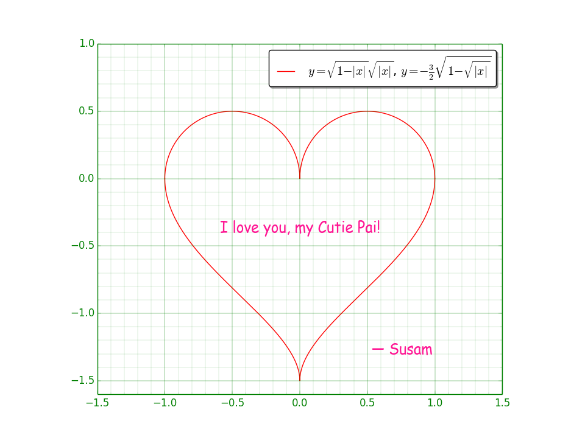

Heart
=====

This project contains a few programs written in Python and C that plot
my heart for my [Cutie Pai][SUNAINA].

[SUNAINA]: https://github.com/sunainapai/

Contents
--------
* [Python (2014)](#python-2014)
* [C (2019)](#c-2019)

Python (2014)
------------

The source code in [heart.py](heart.py) may be executed with Python 3.4
or any later version of Python interpreter. It depends on the the
[Matplotlib](https://pypi.org/project/matplotlib/) package.

### Setup and Run

Enter these commands to set up a virtual Python environment with this
package and run the Python program.

    make py-venv
    make py-heart

The output is written to a PNG file named
[heart-2014-02-14.png](heart-2014-02-14.png).

### Output

### Quadratic and Quartic Curves

To read about the two mathematical functions used in the source code,
see [this thread on Reddit][REDDIT] where I have explained how these
functions plot the curves that form the heart.

[REDDIT]: https://www.reddit.com/r/math/comments/1xwuv3/a_mathematical_valentine/cffeykn/

C (2019)
--------

The source code in [heart.c](heart.c) may be compiled with any standard
C compiler that supports C89 (ANSI C).

### Compile and Run

Enter these commands to compile and run the C program.

    make c-heart

The output is written to a text file named
[heart-2019-02-14.txt](heart-2019-02-14.txt).

### Output

    ...............................................................
    ...............................................................
    .................. @@@@@@@ ......... @@@@@@@ ..................
    ............... @@@@     @@@@ ... @@@@     @@@@ ...............
    ............. @@@           @@@ @@@           @@@ .............
    ............ @@@               @               @@@ ............
    ............ @@@    Cutie Pai,                 @@@ ............
    ............ @@@                               @@@ ............
    ............. @@@         I love you!         @@@ .............
    ............... @@@@                       @@@@ ...............
    .................. @@@@     -- Susam    @@@@ ..................
    ..................... @@@@           @@@@ .....................
    ........................ @@@@     @@@@ ........................
    ........................... @@@ @@@ ...........................
    .............................. @ ..............................
    ...............................................................
    ...............................................................

License
-------

This is free and open source software. You can use, copy, modify,
merge, publish, distribute, sublicense, and/or sell copies of it,
under the terms of the MIT License. See [LICENSE.md][L] for details.

This software is provided "AS IS", WITHOUT WARRANTY OF ANY KIND,
express or implied. See [LICENSE.md][L] for details.

[L]: LICENSE.md
